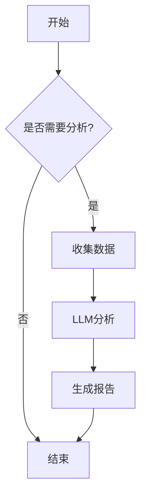
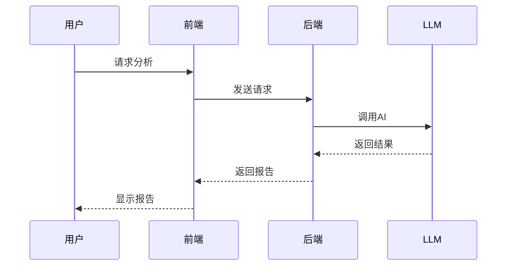
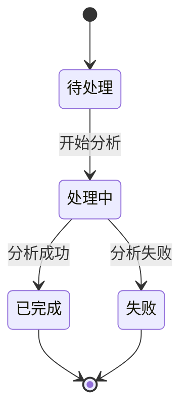
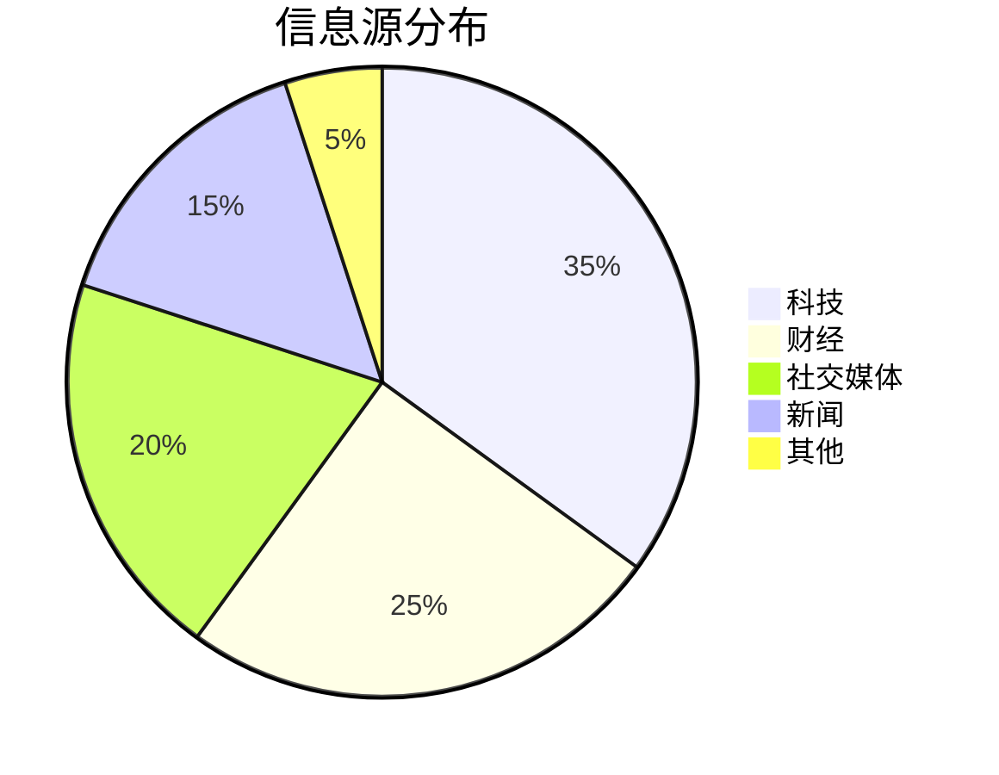

# Markdown 语法测试文档

这个文档用于测试分析报告中的所有Markdown语法支持。

## 1. 基础文本格式

### 粗体和斜体
- **粗体文本**
- *斜体文本*
- ***粗斜体***
- ~~删除线~~

### 行内代码
这是一段包含 `行内代码` 的文本。

## 2. 标题层级

# 一级标题
## 二级标题
### 三级标题
#### 四级标题

## 3. 列表

### 无序列表
- 第一项
- 第二项
  - 嵌套项 2.1
  - 嵌套项 2.2
- 第三项

### 有序列表
1. 第一步
2. 第二步
3. 第三步

### 任务列表（GFM）
- [x] 已完成任务
- [ ] 未完成任务
- [ ] 待处理任务

## 4. 引用块

> 这是一段引用文本。
> 可以包含多行内容。
>
> 甚至可以有段落。

## 5. 代码块

### Python 代码
```python
def hello_world():
    print("Hello, World!")
    return True
```

### JavaScript 代码
```javascript
function greet(name) {
  console.log(`Hello, ${name}!`)
  return true
}
```

### 无语言标注的代码块
```
这是一段纯文本代码块
没有语法高亮
```

## 6. 表格（GFM）

| 功能 | 状态 | 优先级 |
|------|------|--------|
| Mermaid流程图 | ✅ 已实现 | 高 |
| 表格支持 | ✅ 已实现 | 中 |
| 任务列表 | ✅ 已实现 | 低 |

## 7. 链接

[访问GitHub](https://github.com)

## 8. 文章引用（自定义）

根据最新报道，AI技术发展迅速[1]。多个来源证实了这一趋势[2][3][5]。

## 9. 分割线

---

## 10. Mermaid 流程图

### 流程图示例


### 序列图示例


### 状态图示例


### 饼图示例


## 11. 组合测试

### 复杂段落
这是一个**包含多种格式**的段落：*斜体文字*、`代码片段`、~~删除文本~~，以及[外部链接](https://example.com)和文章引用[1][2]。

### 列表中的格式
1. **重要步骤**：执行 `npm install` 安装依赖[3]
2. *可选步骤*：配置环境变量
3. ~~已废弃~~：旧的配置方法

## 12. 转义和特殊字符

- 反斜杠转义：\*不是斜体\*
- HTML实体：&copy; &reg; &trade;
- 特殊符号：< > & " '

---

## 总结

以上测试涵盖了：
- ✅ 基础格式（粗体、斜体、删除线）
- ✅ 标题层级（h1-h4）
- ✅ 列表（有序、无序、任务列表）
- ✅ 引用块
- ✅ 代码块（带语言标注）
- ✅ 表格（GFM）
- ✅ 链接
- ✅ 文章引用（自定义[数字]格式）
- ✅ 分割线
- ✅ **Mermaid流程图**（新增）
- ✅ 组合格式
- ✅ 转义字符
